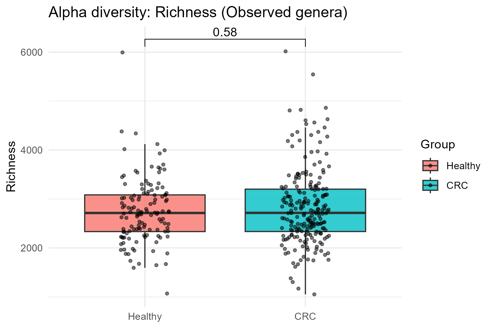
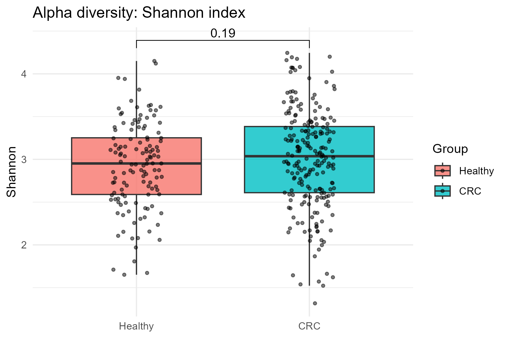
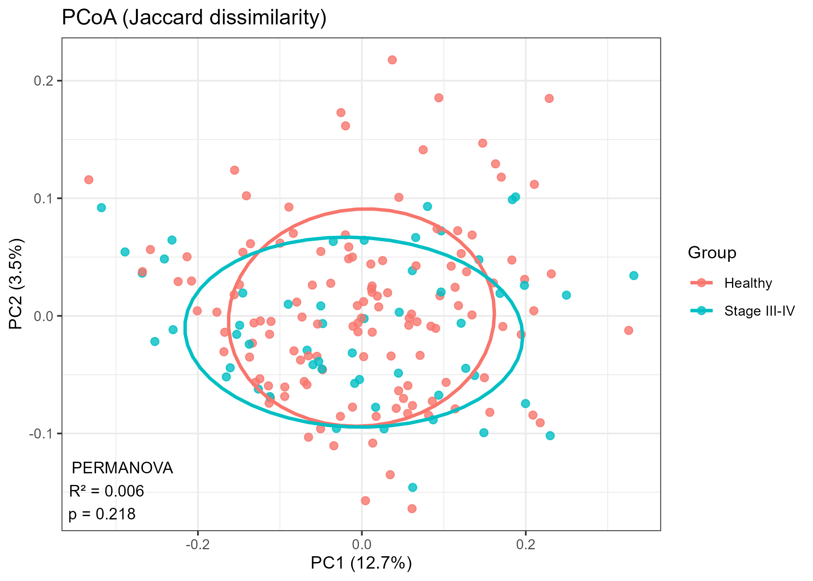

# Microbiome Analysis: Colorectal Cancer (YACHIDA_CRC_2019)

## 📋 Project Overview
This repository contains an R-based pipeline for analyzing microbiome data from the **YACHIDA_CRC_2019** dataset. The analysis focuses on understanding the microbial composition differences across various study groups, with a specific deep dive into comparing **Healthy** individuals against late-stage cancer patients (**Stage III-IV** or **CRC**).

The project covers Exploratory Data Analysis (EDA), Alpha Diversity, and Beta Diversity metrics using standard ecological and statistical tools in R.

---

## 📂 Repository Structure
The project files and outputs are organized as follows:

```text
MicroBiome_analysis/
├── data/
│   ├── metadata.tsv          # Patient metadata including Age and Study Group
│   └── genera.counts.tsv     # Microbiome count matrix at the genus level
├── diagrams/                 # Directory containing generated visualizations
│   ├── densityplot.png       # Density plot of age distribution across groups
│   ├── histogram.png         # Bar plot showing the count of samples per group
│   ├── Richness_Yachida.png  # Alpha diversity (Richness) boxplot
│   ├── Shannon_Yachida.png   # Alpha diversity (Shannon) boxplot
│   └── Q3_Jaccard_PCoA.png   # Beta diversity PCoA plot
├── ex1.R                     # Script for Data Loading and Exploratory Data Analysis (EDA)
├── ex2_and_3.R               # Script for Alpha and Beta Diversity statistical analysis
└── README.md                 # Project documentation
```

---
## 🛠 Methodology & Key Findings

### 1. Exploratory Data Analysis (`ex1.R`)
The first stage involves understanding the dataset's demographics and sample distribution.
* **Sample Distribution:** A bar plot highlights the count of samples per clinical stage (Healthy, HS, MP, Stage_0 to Stage_III_IV). This helps identify potential class imbalances before running statistical tests.
* **Demographics (Age):** A density plot visualizes the age distribution across the different study groups, ensuring there are no extreme age biases between the healthy controls and the cancer patients.

### 2. Alpha Diversity Analysis (`ex2_and_3.R`)
Alpha diversity evaluates the microbial diversity *within* a single sample. We focused on comparing the Healthy group against the CRC (Cancer) group.
* **Metrics Calculated:** We evaluated **Observed Genera (Richness)** to count the unique taxa, and the **Shannon Diversity Index** to measure both richness and evenness.
* **Statistical Testing & Results:** Wilcoxon rank-sum tests were performed to compare the groups.
  * For **Richness**, the test yielded p = 0.58.
  
  
 
  * For the **Shannon Index**, the test yielded p = 0.19.

  

* **Interpretation:** Because both p-values are greater than 0.05, we conclude there is **no statistically significant difference** in local microbial diversity (alpha diversity) between healthy individuals and those with colorectal cancer in this specific dataset. The boxplots visually confirm this, showing highly overlapping distributions.

### 3. Beta Diversity Analysis (`ex2_and_3.R`)
Beta diversity assesses the microbial community differences *between* different samples.
* **Distance Matrix & PCoA:** We computed the **Jaccard dissimilarity index** (based on presence/absence of genera) and performed a Principal Coordinates Analysis (PCoA) to visualize sample clustering in a 2D space.
* **Statistical Testing (PERMANOVA):** To quantify the variance explained by the clinical condition (Healthy vs. Stage III-IV), we ran a PERMANOVA (`adonis2` with 999 permutations).
* **Results & Interpretation:** The PERMANOVA results showed an R² = 0.006 and a p-value of 0.218.
  * The R² indicates that the study group explains less than **1%** of the variance in the microbiome composition.
  * The p-value (p > 0.05) confirms that this separation is **not statistically significant**. The generated PCoA plot visually supports this, as the confidence ellipses for the Healthy and Stage III-IV groups heavily overlap, showing no distinct community structure separation.

  

---

## 🚀 How to Run

**1. Install Required R Packages:**
Ensure you have the following packages installed in your R environment:
```R
install.packages(c("tidyverse", "patchwork", "ggpubr"))
install.packages('vegan', repos = c('[https://vegandevs.r-universe.dev](https://vegandevs.r-universe.dev)','[https://cloud.r-project.org](https://cloud.r-project.org)'))
```
**2. Execute the Scripts:
* Run ```ex1.R``` to download the datasets directly from the Borenstein Lab repository and generate the initial EDA plots.
* Run ```ex2_and_3.R``` to compute diversity metrics, run statistical tests, and generate the comparative plots. Outputs will be saved automatically in your working directory.
---

## Requirements
The analysis relies on the following R packages:
* `tidyverse`: For data manipulation and visualization.
* `vegan`: For ecological diversity indices and PERMANOVA.
* `ggpubr`: For adding statistical layers to plots.
* `patchwork`: For combining multiple plots into single figures.

## How to Run
1. Ensure you have an active internet connection to download the datasets directly from the provided URLs.
2. Run `ex1.R` first to understand the data structure and population demographics.
3. Run `ex2_and_3.R` to execute the statistical comparisons and diversity analyses.
